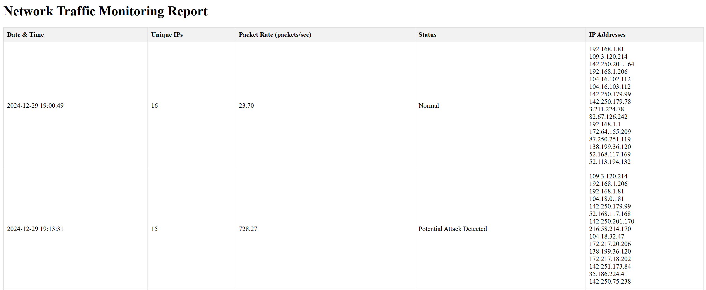

<!-- PROJECT IA DETECTION ATTACK -->

<!-- PROJECT LOGO -->
<br />
<div align="center">


<h3 align="center">Projet : Network Traffic Monitoring Report</h3>

  <p align="center">
    Détection d'attaques réseaux simples avec implémentation d'une IA
    <br />
    <a href="https://github.com/Deddenne/FYC.git"><strong>Explorer le projet »</strong></a>
    <br />
    <br />
    <a href="https://github.com/github_username/repo_name">voir une démo</a>
  </p>
</div>


<!-- ABOUT THE PROJECT -->
## A propos du projet



---

**Description du script :**

Ce script est conçu pour surveiller le trafic réseau en temps réel et détecter les potentielles attaques par déni de service distribué (DDoS) à l'aide d'un modèle d'intelligence artificielle (IA). Il effectue les tâches suivantes :

1. **Surveillance du trafic réseau :**
   - Le script capture les paquets réseau entrants en utilisant la bibliothèque Scapy.
   - Il enregistre les adresses IP sources des paquets pour analyse.

2. **Analyse statistique du trafic :**
   - Il calcule le nombre d'adresses IP uniques détectées.
   - Il mesure le taux de paquets reçus par seconde (packet rate).

3. **Détection des attaques :**
   - Un modèle IA préalablement entraîné, chargé depuis un fichier (`ddos_detector_model.pkl`), prédit si les statistiques réseau correspondent à une situation normale ou à une attaque.
   - Le modèle prend en entrée le nombre d'IP uniques et le taux de paquets pour déterminer le statut du trafic.

4. **Rapport et alertes :**
   - Si une attaque est détectée, le script peut envoyer une alerte par e-mail au destinataire spécifié.
   - Les résultats de chaque cycle de surveillance sont enregistrés dans un fichier HTML, sous forme de rapport détaillé contenant :
     - La date et l'heure.
     - Le nombre d'IP uniques.
     - Le taux de paquets.
     - Le statut (normal ou potentiel attaque).
     - La liste des adresses IP détectées.

5. **Boucle de surveillance continue :**
   - Le script fonctionne en boucle, effectuant des cycles de surveillance de durée définie (`MONITORING_DURATION`, par défaut 10 secondes).
   - Entre chaque cycle, une pause de 5 secondes est appliquée.

6. **Facilité de configuration :**
   - Les paramètres, comme les identifiants d'e-mail, le serveur SMTP, et le nom du fichier HTML de sortie, peuvent être configurés facilement.

**Applications potentielles :**
- Surveillance proactive des réseaux pour prévenir les attaques DDoS.
- Génération de rapports pour analyser le trafic réseau.
- Détection rapide des anomalies pour intervenir rapidement en cas d'incident.

**Remarque importante :**
Le script inclut une alerte par e-mail, mais cette fonctionnalité est désactivée dans le code fourni (ligne commentée : `send_email(alert_message)`), probablement pour des tests ou par précaution.

---


### Built With

* [![Python][Python.js]][Python-url]

---

<!-- GETTING STARTED -->
## Lancer le projet

This is an example of how you may give instructions on setting up your project locally.
To get a local copy up and running follow these simple example steps.

### Prerequisites

Installer les modules suivants : 
* python3 
  ```sh
  sudo apt install python3
  ```

* python3-pip
  ```sh
  sudo apt install python3-pip
  ```

* scapy, numpy, pandas & scikit-learn
  ```sh
  pip install scapy numpy pandas scikit-learn
  ```

### Installation
1. Cloner the repository
   ```sh
   git clone https://github.com/Deddenne/FYC.git
   ```
2. Lancer le fichier pour entraîner l'IA
   ```sh
   pyhton3.exe .\train.py
   ```
3. Lancer le fichier de détection
   ```sh
   python3.exe .\main.py
   ```

<p align="right">(<a href="#readme-top">back to top</a>)</p>


<!-- USAGE EXAMPLES -->
## Usage

Use this space to show useful examples of how a project can be used. Additional screenshots, code examples and demos work well in this space. You may also link to more resources.

_For more examples, please refer to the [Documentation](https://example.com)_


<!-- CONTRIBUTING -->
## Contribuer

Les contributions sont ce qui fait de la communauté open source un endroit incroyable pour apprendre, s'inspirer et créer. Toute contribution que vous apportez est **grandement appréciée**.

Si vous avez une suggestion pour améliorer ce projet, n'hésitez pas à forker le dépôt et à créer une pull request.
N'oubliez pas de mettre une étoile au projet ! Merci encore !

### Étapes pour contribuer :
1. Forkez le projet.
2. Créez une branche pour votre fonctionnalité (`git checkout -b feature/AmazingFeature`).
3. Validez vos modifications (`git commit -m 'Add some AmazingFeature'`).
4. Poussez la branche (`git push origin feature/AmazingFeature`).
5. Ouvrez une pull request.

### Top contributors:

<a href="https://github.com/Deddenne/FYC/graphs/contributors">
  
</a>


<!-- LICENSE -->
## License

Distributed under the project_license. See `LICENSE.txt` for more information.


<!-- MARKDOWN LINKS & IMAGES -->
<!-- https://www.markdownguide.org/basic-syntax/#reference-style-links -->
[Python-url]: https://www.python.org/
[Python.js]: https://img.shields.io/badge/python-3.10-blue?style=for-the-badge&logo=python&logoColor=white

